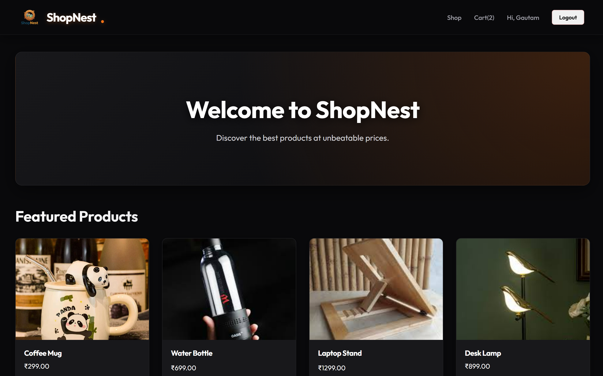
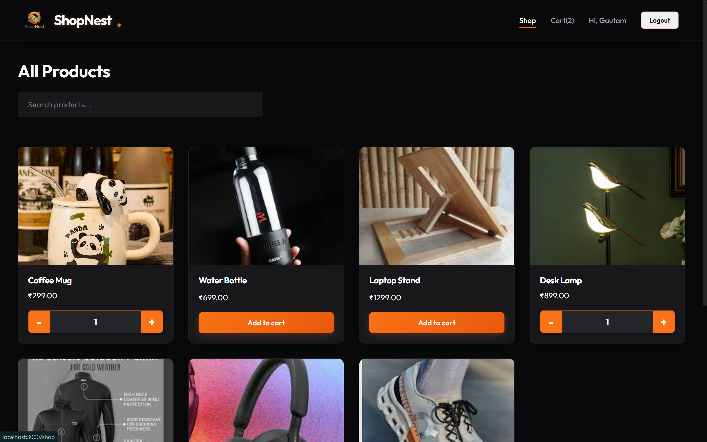
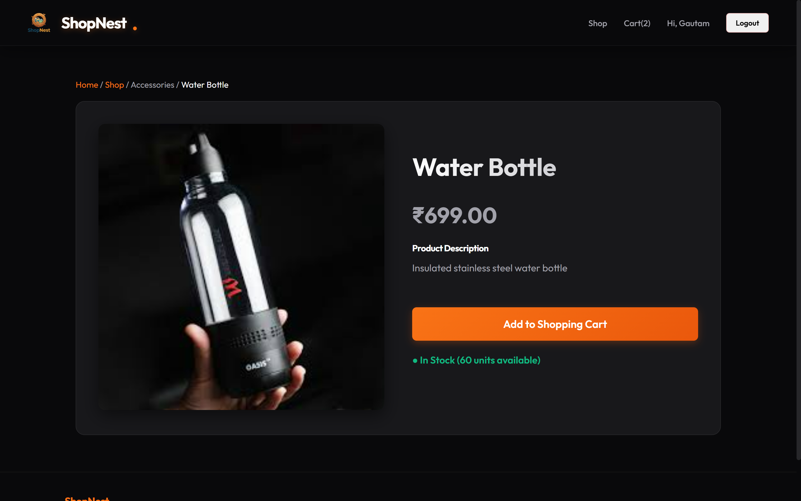
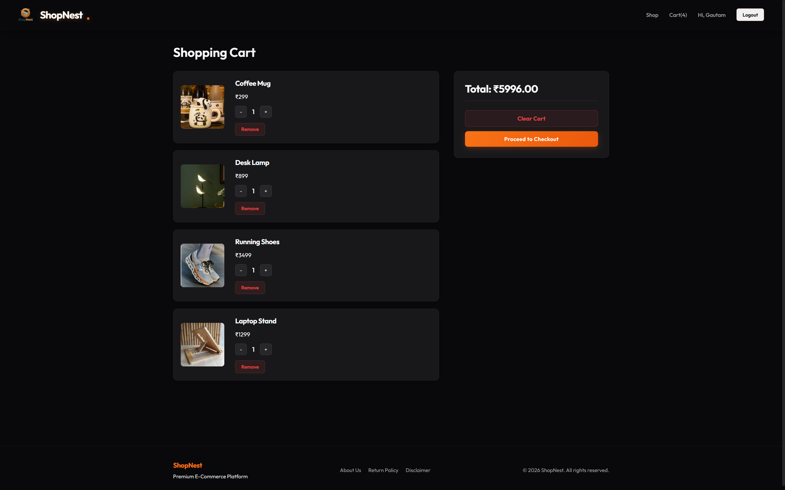
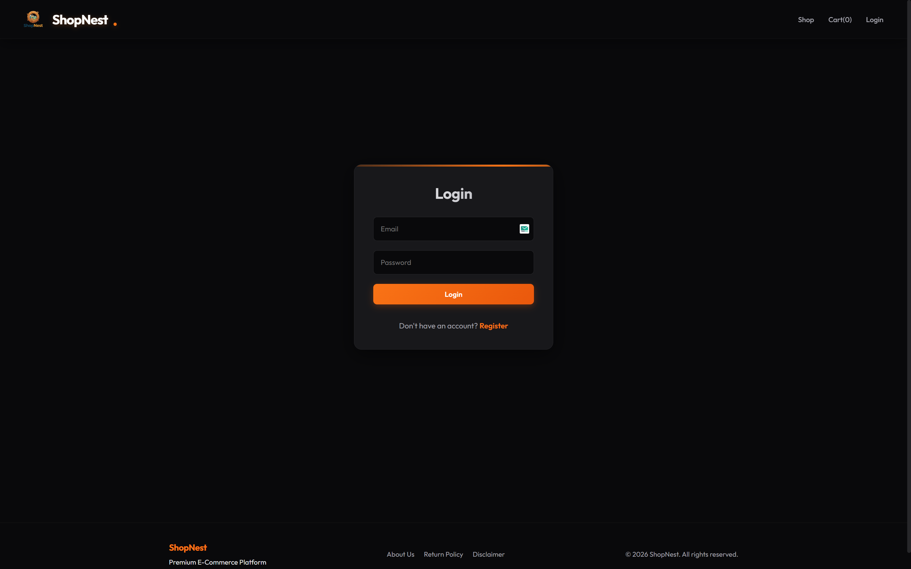
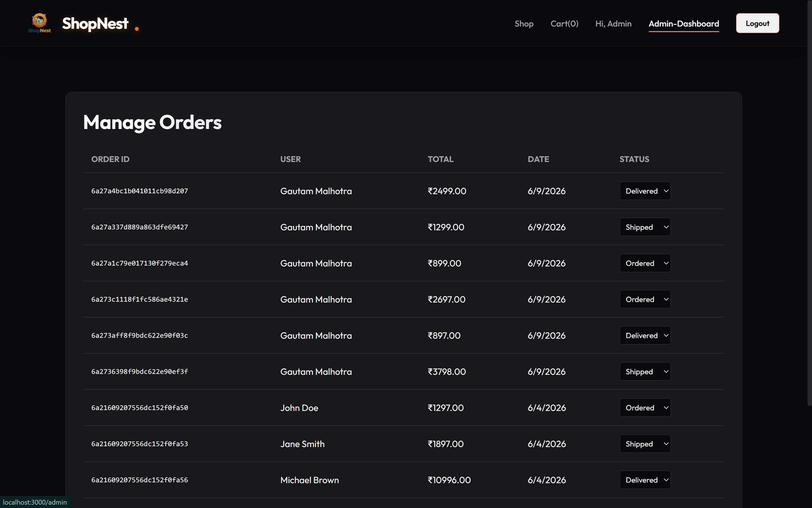
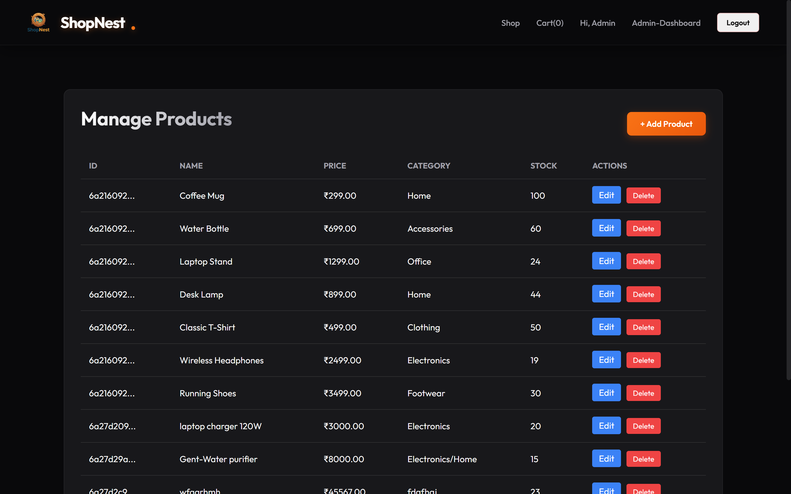
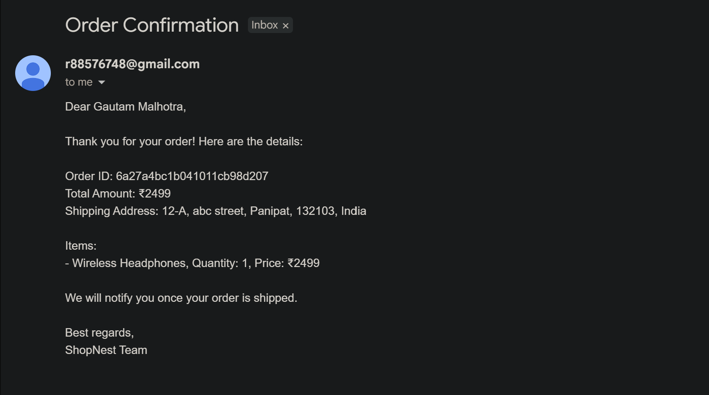
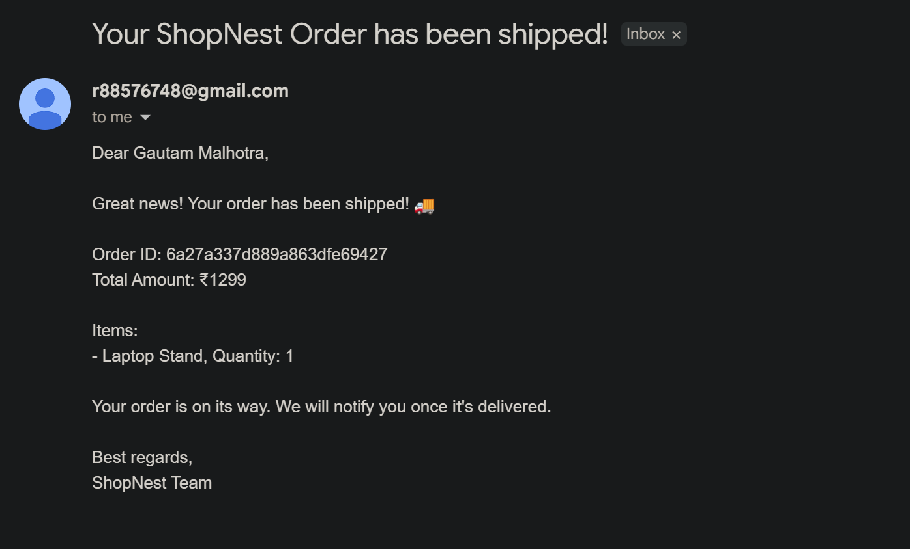
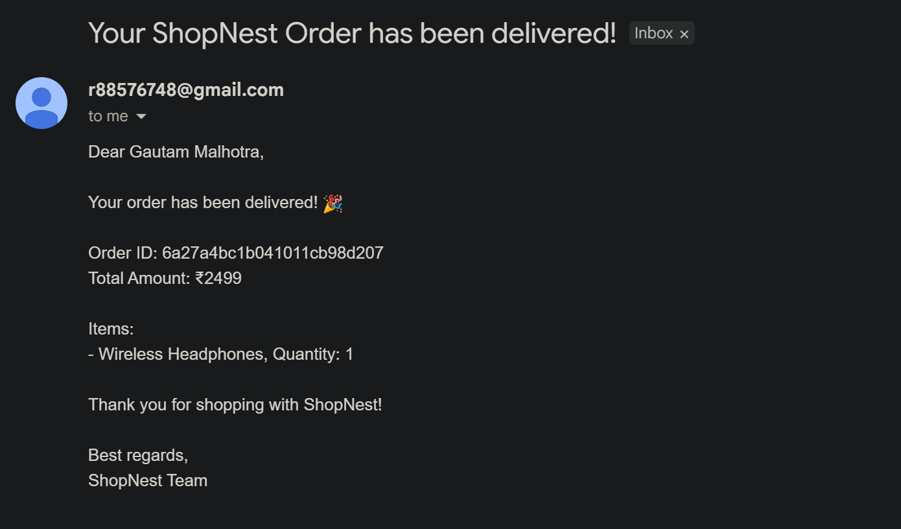

# 🛍️ ShopNest — Full Stack E-Commerce Platform

> A modern, full-featured e-commerce web application built with the MERN stack. ShopNest offers a seamless shopping experience with a clean UI, secure authentication, and a powerful admin panel.

---

## 📸 Screenshots

### 🏠 Home Page
<!-- Add screenshot here -->


### 🛒 Shop / Products Page
<!-- Add screenshot here -->


### 📦 Product Detail Page
<!-- Add screenshot here -->


### 🧾 Cart & Checkout
<!-- Add screenshot here -->


### 🔐 Login / Register
<!-- Add screenshot here -->


### 🛠️ Admin Panel — Orders
<!-- Add screenshot here -->


### 🛠️ Admin Panel — Products
<!-- Add screenshot here -->


---

## 📧 Email Notifications — Screenshots

### ✅ Welcome / Verification Email
<!-- Add screenshot of verification email received here -->


### 📦 Order Confirmation Email
<!-- Add screenshot of order confirmation email received here -->


### 🚚 Order Shipped Email
<!-- Add screenshot of shipped email received here -->


### 🎉 Order Delivered Email
<!-- Add screenshot of delivered email received here -->


---

## ✨ Features

### 👤 User
- Register & Login with JWT authentication
- Email-based verification on signup
- Browse and search products
- View detailed product pages
- Add to cart and place orders
- Order confirmation email on purchase
- Order status update emails (Shipped / Delivered)
- View personal order history

### 🛠️ Admin
- Secure admin-only access
- Add, update, and delete products
- Upload product images via Cloudinary
- View and manage all user orders
- Update order status (Ordered → Shipped → Delivered)

---

## 🧰 Tech Stack

### Frontend
| Technology | Purpose |
|---|---|
| React | Frontend framework |
| React Router DOM | Client-side routing |
| Context API | Global state management |
| CSS | Custom styling |

### Backend
| Technology | Purpose |
|---|---|
| Node.js | Runtime environment |
| Express.js | Backend framework |
| MongoDB + Mongoose | Database |
| JWT | Authentication |
| Bcrypt.js | Password hashing |
| Cloudinary | Image storage |
| Nodemailer | Email service |
| Express Rate Limiter | API protection |
| Multer | File upload handling |

---

## 📁 Project Structure

```
ShopNest/
├── backend/
│   ├── config/
│   │   ├── db.js               # MongoDB connection
│   │   └── cloudinary.js       # Cloudinary setup
│   ├── controllers/
│   │   ├── authController.js
│   │   ├── productController.js
│   │   └── orderController.js
│   ├── middlewares/
│   │   ├── authMiddleware.js
│   │   └── adminMiddleware.js
│   ├── models/
│   │   ├── User.js
│   │   ├── Product.js
│   │   └── Order.js
│   ├── routes/
│   │   ├── authRoutes.js
│   │   ├── productRoutes.js
│   │   └── orderRoutes.js
│   ├── utils/
│   │   ├── sendEmail.js
│   │   └── generateToken.js
│   └── index.js
│
├── frontend/
│   ├── public/
│   └── src/
│       ├── components/
│       ├── context/
│       ├── pages/
│       └── main.jsx
│
├── .gitignore
├── ShopNest.postman_collection.json
└── README.md
```

---

## 🚀 Getting Started

### Prerequisites
Make sure you have the following installed:
- [Node.js](https://nodejs.org/) (v18+)
- [MongoDB](https://www.mongodb.com/) or MongoDB Atlas account
- [Cloudinary](https://cloudinary.com/) account
- [Git](https://git-scm.com/)

---

### 🔧 Installation

**1. Clone the repository**
```bash
git clone https://github.com/MGautam-88/ShopNest.git
cd ShopNest
```

**2. Install all dependencies at once**
```bash
npm install
cd backend && npm install
cd ../frontend && npm install
cd ..
```

---

### ⚙️ Environment Variables

Create a `.env` file inside the `backend/` folder and add the following:

```env
PORT = 5000
NODE_ENV = development

# MongoDB
DB_URI = your_mongodb_connection_string

# JWT
JWT_SECRET = your_jwt_secret_key
JWT_EXPIRE = 7d

# Cloudinary
CLOUDINARY_NAME = your_cloudinary_name
CLOUDINARY_API_KEY = your_cloudinary_api_key
CLOUDINARY_API_SECRET = your_cloudinary_api_secret

# Email (Nodemailer)
SMTP_EMAIL = your_email@gmail.com
SMTP_PASSWORD = your_email_app_password
```

> ⚠️ Never share or commit your `.env` file. It's already added to `.gitignore`.

---

### ▶️ Running the App

#### 🚀 Run Both at Once (Recommended)

Install `concurrently` from the root folder:
```bash
npm install concurrently --save-dev
```

Add this to your **root** `package.json` scripts:
```json
"scripts": {
  "dev": "concurrently \"cd backend && npm run dev\" \"cd frontend && npm run dev\""
}
```

Then just run:
```bash
npm run dev
```

Both backend and frontend will start together! ✅

---

#### ▶️ Run Separately (Alternative)

**Backend**
```bash
cd backend
npm run dev
```
Runs on → `http://localhost:5000`

**Frontend**
```bash
cd frontend
npm run dev
```
Runs on → `http://localhost:5173`

---

## 📬 API Endpoints

### Auth
| Method | Endpoint | Description |
|---|---|---|
| POST | `/api/auth/register` | Register new user |
| POST | `/api/auth/login` | Login user |
| GET | `/api/auth/profile` | Get user profile |

### Products
| Method | Endpoint | Description |
|---|---|---|
| GET | `/api/products` | Get all products |
| GET | `/api/products/:id` | Get single product |
| POST | `/api/products` | Create product (Admin) |
| PUT | `/api/products/:id` | Update product (Admin) |
| DELETE | `/api/products/:id` | Delete product (Admin) |

### Orders
| Method | Endpoint | Description |
|---|---|---|
| POST | `/api/orders` | Create new order |
| GET | `/api/orders/my` | Get logged-in user's orders |
| GET | `/api/orders` | Get all orders (Admin) |
| PUT | `/api/orders/:id/status` | Update order status (Admin) |

> 📂 Full API collection available in `ShopNest.postman_collection.json`

---

## 📧 Email Notifications

ShopNest automatically sends emails to users for:

| Event | Email Sent |
|---|---|
| ✅ Register | Welcome & Email Verification |
| ✅ Order Placed | Order Confirmation with details |
| ✅ Order Shipped | Shipping notification |
| ✅ Order Delivered | Delivery confirmation |

---

## 👨‍💻 Author

**Gautam**
- GitHub: [@MGautam-88](https://github.com/MGautam-88)

---

## 📄 License

This project is open source and available under the [MIT License](LICENSE).

---

*Made with ❤️ by Gautam | ShopNest © 2025*
